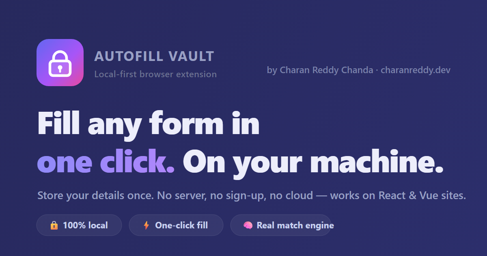

<div align="center">

# 🔐 Autofill Vault

### Store your details once. Fill any form in one click. Everything stays on your machine.

A privacy-first browser extension that ends the tyranny of retyping your name, email, phone, address and logins into every form on the internet — without sending a single byte to anyone's server.

**[🌐 Live showcase](https://autofill-charan.vercel.app/)** · **[📓 The story](https://autofill-charan.vercel.app/about-project)** · **[👋 About me](https://autofill-charan.vercel.app/about)** · **[💻 Source](https://github.com/charanreddy-27/Autofill)**



</div>

---

## ✨ Why this exists

Browsers have built-in autofill — but it's a black box. It fires when it feels like it, fumbles modern single-page apps, and you can't see or shape what it knows. Password managers nailed this for logins. **Nobody nailed it for everything else.**

Autofill Vault is the tool I wanted during a long stretch of job applications: a vault I fully control, that fills *any* form on command, and never touches a network. Local-first isn't a feature here — it's the whole point.

## 🎬 What it does

- **⚡ One-click whole-page fill** — toolbar button or `Alt+Shift+F`. Every matching field fills at once and flashes blue so you see what happened.
- **🧠 A real matching engine** — scores each input on its `autocomplete` token, native type, label, placeholder and your own keywords, then fills the best match (and skips fields you've already touched).
- **🗂️ Your vault, your structure** — Personal, Address, Education, Professional, plus any category you add. Inline-edit, drag-reorder, recolour. Autosaves as you type. A 📋 copy button on every field.
- **🔑 Logins, filled smartly** — store site / username / password and fill login forms, including multi-step ones, by finding the username field nearest the password input in document order.
- **🔒 Nothing leaves your machine** — everything lives in `chrome.storage.local` on this profile only. No telemetry, no account, no cloud. Export/import a JSON backup anytime.
- **🌗 Polished, light or dark** — glassmorphism, an animated aurora, and keyboard shortcuts. The kind of internal tool you'd actually enjoy opening.

### Ways to trigger autofill

| Action | How |
|---|---|
| Fill the whole page | Popup → **⚡ Fill this page**, or **Alt+Shift+F** |
| Fill a login | Popup → **Fill** next to the matching account |
| Right-click | **Autofill this page** |
| Open the popup | **Alt+Shift+V** |

## 🧠 The interesting part: filling forms that fight back

The hard problem isn't *finding* fields — it's filling React/Vue inputs in a way the framework believes. Setting `el.value` updates the DOM but not the framework's internal state, so the form submits empty. The fix:

```js
// Call the prototype's native value setter, then fire real events —
// indistinguishable from a human typing. This one function is why it works.
function setNativeValue(el, value) {
  const proto = Object.getPrototypeOf(el);
  const desc  = Object.getOwnPropertyDescriptor(proto, "value");
  if (desc && desc.set) desc.set.call(el, value);
  else el.value = value;
}
function fireEvents(el) {
  el.dispatchEvent(new Event("input",  { bubbles: true }));
  el.dispatchEvent(new Event("change", { bubbles: true }));
}
```

The full write-up — scoring, multi-step logins, the shared-brain architecture — is in **[PROJECT_DEEP_DIVE.md](PROJECT_DEEP_DIVE.md)**.

## 🚀 Install (load unpacked)

Works in **Chrome**, **Edge**, **Brave**, and any Chromium browser.

1. **Download / clone** this repo.
2. Open `chrome://extensions` (Edge: `edge://extensions`).
3. Turn on **Developer mode** (top-right).
4. Click **Load unpacked** and select the repo's root `Autofill` folder.
5. Pin the extension → click its icon → **⚙️** to open the dashboard and fill in your details.

> To test on the bundled `test/sample-form.html` (a `file://` page), open the extension's **Details** and enable **Allow access to file URLs**. Normal websites don't need this.

## 🧰 Tech stack

| Choice | Why |
|---|---|
| **Manifest V3** | The current, future-proof extension model — service worker + `scripting` API. |
| **Vanilla JS, no build** | Zero dependencies. A privacy tool should be trivially auditable. |
| **`chrome.storage.local`** | On-device, per-profile, event-driven. The honest answer to "where's my data?" |
| **Modern CSS** | `color-mix`, custom properties, backdrop blur — a polished UI with no framework. |

## 📁 Structure

```
manifest.json            MV3 manifest
icons/                   Toolbar icons (16/32/48/128)
src/
  common.js              Data model, field dictionary, storage helpers (shared everywhere)
  content.js             The autofill engine injected into pages
  content.css            Fill highlight + on-page toast
  background.js          Service worker: shortcut, right-click menu
  dashboard.html/css/js  The vault management UI
  popup.html/css/js      Toolbar popup
test/sample-form.html    A practice form to test autofill
web/                     The showcase site (this README's live link) — deploys to Vercel
docs ─ PROJECT_DEEP_DIVE.md · INTERVIEW_PREP.md · DEPLOYMENT.md
```

No build step on the extension — edit a file, hit **Reload**.

## 🔒 A note on privacy

By design, this is deliberately simple:

- Data is stored **unencrypted** in `chrome.storage.local`, readable only by this extension on this browser profile. It is **never** synced or uploaded.
- **Passwords are stored in plain text.** Fine for convenience; *not* a substitute for a dedicated password manager on high-value accounts (bank, primary email).
- Anyone with access to your unlocked profile can read the vault. Use **⚙️ → Export backup** regularly.

---

## 👋 About the developer

I'm **Charan** — an AI & automation engineer in Bangalore. I build production LLM systems (one of them a Springer-published model that reads chest X-rays), and before that wrote real-time control code for jet engines at DRDO. This is the small tool I built for myself between the big ones.

**This is one project. There are 18 more (and a few jet engines) over at [charanreddy.dev](https://www.charanreddy.dev).**

[🌐 Portfolio](https://www.charanreddy.dev) · [💼 LinkedIn](https://www.linkedin.com/in/chandacharanreddy/) · [🐙 GitHub](https://github.com/charanreddy-27) · [📅 Book a call](https://cal.com/charanreddy-27/30min) · [🔬 ORCID](https://orcid.org/0009-0003-2414-6717)

> Want to build something — or break something interesting? **Let's talk.**

## 📄 License

[MIT](LICENSE) — do whatever you like, just don't blame me. Crafted with intent.
